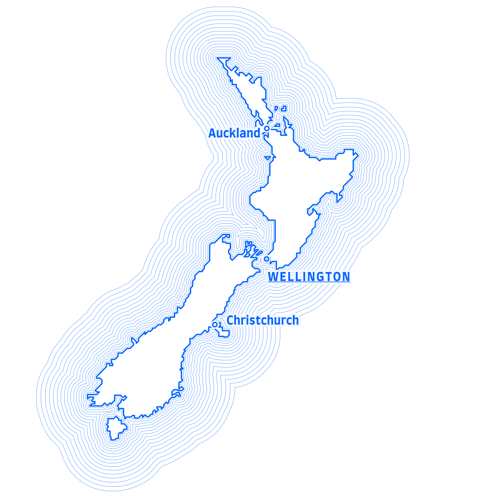
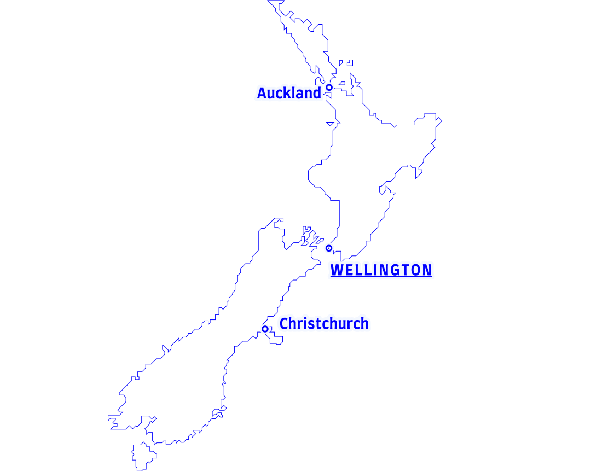
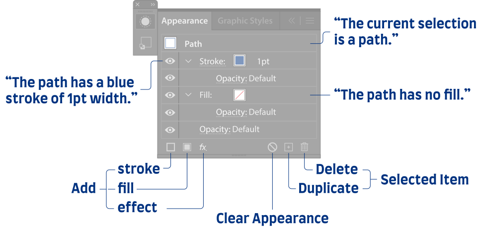

import Callout from "../../../../components/Callout.astro";
import FolderTree from "../../../../components/FolderTree.astro";
import Figure from "../../../../components/Figure.astro";

## Introduction

Before we actually get to the how-to, I would like to briefly introduce the topic of waterlines and why they can be a great addition to your maps. If you are already familiar with the concept and just want to get to the how-to, feel free to skip immediately to [Step 1](#step-1).

### What are waterlines?

According to a scientific definition[1](#ref-1) waterlines are

> "… lines representing water, drawn parallel with the edge of a water feature, which decrease in proximity and strength away from that edge"

But to me they are, above all, visually pleasing and fun to look at. Sometimes they are called _coast styles_ or ­*shorelines*.
They were particularly popular in maps made in the nineteenth century, which is, I believe, the reason why nowadays map makers tend to use them primarily: they want to add a somewhat vintage vibe to their maps.

<Figure caption="A typical style of waterlines in a map of New Zealand.">
  
</Figure>

### Why using waterlines?

There are several reasons for employing waterlines in your maps:

- They allow for a better figure-ground contrast: I bet you came across a map, usually of a geographic region you're not that familiar with or a known region in an unusual projection, where you were not sure what is land and what is water or ocean. Waterlines can be super helpful here, because …
- … they mimic the moving water: it’s like the small waves you can observe when you throw a small stone into a quiet lake.
- In some cases where you don’t want to or can’t (e.g. for monochrome maps) use the color blue, they can be helpful to still make your map readers immediately differentiate water bodies from land bodies
- And lastly, coming back to the argument of vintage look and feel: waterlines do convey connotations like “art & beauty, motion and history”[2](#ref-2) to many readers, which comes in handy from time to time for certain maps.

## Step 1: Prepare the geodata

Obviously, we need something to apply the waterlines to.
For this I usually download and process data in QGIS and then export it as svg, to open it in Illustrator.
Sometimes, in particular if I aim for a very stylized look, I trace (and schematize) the outlines manually in Illustrator.

I will also use a manually schematized outline for this tutorial. If you want to follow along, you can download the svg file below [here](./outlines.svg).

<Figure caption="Schematized outline of New Zealand in Adobe Illustrator.">
  
</Figure>

## Step 2: Ensure your document is well organized

One of the seemingly boring and unnecessary tasks during any creative process such as map design, is to keep things tidy. However, I believe it is real super power, and in particular when using the appearance tool (the very next step), this really pays off. You can only harness the full potential of the appearance panel approach if your document is structured well.

But what does that mean in praxis? For example, I suggest creating a layer "map geometries" for the map geometries and then create a sublayer which we can call "administrative units". We place all our geometries there. We could move e.g. point data into a different sublayer called "cities".

That's how the layer structure could look like:

<Figure caption="Example of a layer structure in Adobe Illustrator.">
  
</Figure>

## Step 3: Use the appearance panel

Let me make you acquainted with the star of the show -- and one of the, I think, most interesting tools in Adobe Illustrator -- the Appearance panel.

<Figure caption="The Appearance panel in Illustrator in all its glory. It is dependent on the current selection. That's how it looks when the outlines of New Zealand from above are selected.">
  
</Figure>

The appearance panel is probably by far the tool I spend the most time with when working in Illustrator. Simply because, sometimes it's the most efficient way of doing things, and also because it brings me the most joy 🙂. It allows adding fills, strokes and effects to objects, groups and layers.

<Callout style={{ margin: "var(--spacing) 0" }}>
  <header style="font-weight: bold;">
    Small digression on non destructive design
  </header>
    *Why do I think the Appearance tool is so useful?* Because it facilitates
    non destructive design. That means in general, that it is easy to revert
    changes, and no design decisions should never kind of lock you in -- making
    it difficult to go back to a certain stage and go another route.

    More specifically, using the waterlines example, this means: if you have
    already created the waterlines and then for some reason you realize you want
    to change the geometry New Zealand's main islands (let's say you need to
    change the generalization, or simply scale down the size of the map
    features), you can simply edit the geometry right in Illustrator and the
    derived waterlines (generated with the appearance tool) will adjust (I don't
    need to re-create them again).

</Callout>

If you use the _Essential_ workspace the Appearance Panel should be visible by default. (Workspaces are saved states of Illustrator's user interface, with certain tools and panels visible. You can switch between ready-made workspaces and even create custom ones.) If you don't see the Appearance Panel for any reason, you can always enable it via `Window → Appearance` or -- if you prefer shortcuts -- with <kbd>⇧</kbd> (Shift key) and <kbd>F6</kbd>.

The following image shows all possible actions one can do via the appearance panel -- I will go through each of them in this section:

<Figure caption="The Appearance Panel lists all fills, strokes and effects applied to objects and allows to manipulate them.">
  
</Figure>

In general the panel allows you do two things:

1. To inspect all the applied fills, strokes and effects of the current selection.
2. to manipulate (add, remove, change order) these fills, strokes and effects: change properties of the
   - fill (color or color swach, opacity)
   - and the stroke (color or color swatch, opacity, width, stroke join, stroke ends, dash pattern etc.)
   - and the overall opacity of the selected item

Items can be paths (or shapes), groups (of paths) and layers or sublayers. That's a bit confusing when you start using the appearance panel -- what's the difference between adding a stroke to a path vs. adding it to a group or a layer? And why should I even do this in the first place?

When you add a stroke or a fill to one or multiple paths (left side), the stroke is applied directly to that path or each of those paths. When you add a stroke to a group (right), the stroke is applied one to the whole group. This subtle difference can make a big difference in the look of your artwork. The difference is immediately apparent when we change the order of the stroke and the fill: if the stroke is applied to a group and is below the fill, parts of it will be hidden by the groups fill. By this we can create a nice comic-like outline effect to complex shapes, consisting of multiple simple shapes, without the need to merge them into one shape.

<Figure caption="Difference between adding a stroke to a path (left) and to a group (right). Notice, how the <em>Contents</em> item, containing the individual paths of the group, is available in the Appearance Panel. You can double click on it to edit the appearance of the individual paths and move it up and down to change the rendering order.">
  
</Figure>

With the example above, I wanted to show that certain visual styles can only be achieved by adding strokes (and fills or effects) to groups or layers instead of individual paths.

## Step 4: Experiment with the different variations of waterlines

Now we can finally get to the fun part: creating the waterlines! I will show you how to create different variations of waterlines. We will start with the most basic one, which is also the most common style.

1. The first step is to select the layer which contains the geometries we want the outlines to apply to.
2. Then we reset the appearance of the layer and its content (this depends on how you imported or created the geometries in Illustrator, if you use the file I provided you can skip this step, because the appearance is already reset).
3. Now we add a new stroke to the layer and set its color to a light blue and its width to 1 pt. This is the stroke which will become the shore line.
4. Then we add a second stroke by clicking on the "Duplicate Selected Item" button in the Appearance Panel. We set the color to a darker blue and the width to 2 pt. This is the stroke which will become the first waterline.

## Step 5: (Optional) Saving appearance as a reusable style

## Sources

- [1] ICA, 1973. Multilingual Dictionary of Technical
  Terms in Cartography
- [2] Huffman, D.P., 2010. On Waterlines: Arguments for
  their Employment, ­Advice on their Generation. CP 23–30.
  https://doi.org/10.14714/CP66.94
- [3] Adobe Illustrator’s Appearance Panel
