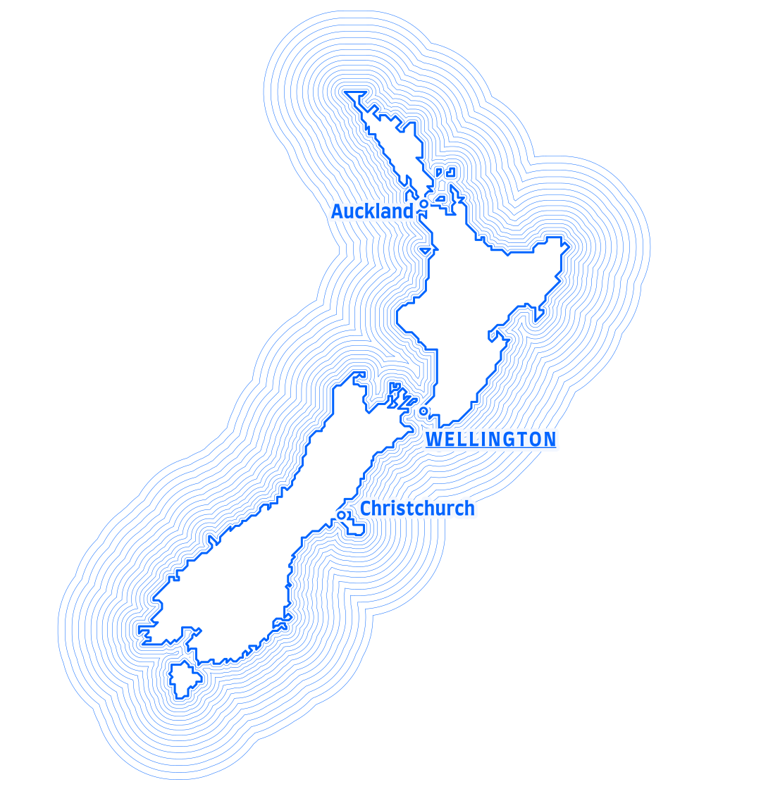
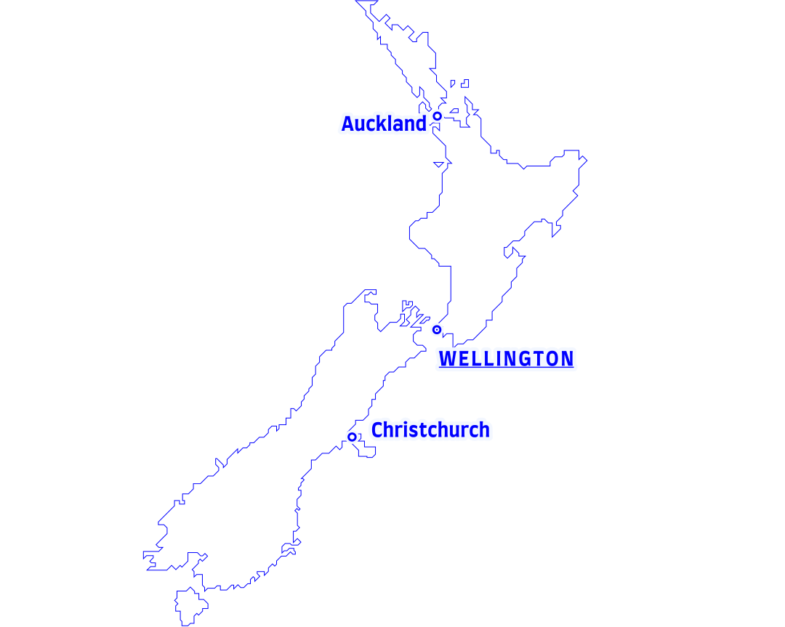
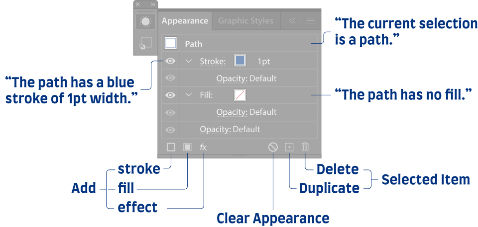

import Callout from "../../../../components/Callout.astro";
import FolderTree from "../../../../components/FolderTree.astro";
import Figure from "../../../../components/Figure.astro";
import DuplicateIcon from "duplicate-icon.svg";
import FxIcon from "fx-icon.svg";
import TrashIcon from "trash-icon.svg";
import outlinesFile from "./outlines-new-zealand.ai";

## Introduction

Before we actually get to the how-to, I would like to briefly introduce the topic of waterlines and why they can be a great addition to your maps. If you are already familiar with the concept and just want to get to the how-to, feel free to skip immediately to [Step 1](#step-1).

### What are waterlines?

According to a scientific definition[1](#ref-1), waterlines are

> "… lines representing water, drawn parallel with the edge of a water feature, which decrease in proximity and strength away from that edge"

But to me they are, above all, visually pleasing and fun to look at. Sometimes they are called _coast styles_ or ­*shorelines*.
They were particularly popular in maps made in the nineteenth century, which is, I believe, the reason why nowadays map makers tend to use them primarily: they want to add a somewhat vintage vibe to their maps.

<Figure caption="A typical style of waterlines in a map of New Zealand.">
  
</Figure>

### Why using waterlines?

There are several reasons for employing waterlines in your maps:

- They allow for a better figure-ground contrast: I bet you came across a map, usually of a geographic region you're not that familiar with or a known region in an unusual projection, where you were not sure what is land and what is water or ocean. Waterlines can be super helpful here, because …
- … they mimic the moving water: it’s like the small waves you can observe when you throw a small stone into a quiet lake.
- In some cases where you don’t want to or can’t (e.g. for monochrome maps) use the color blue, they can be helpful to still make your map readers immediately differentiate water bodies from land bodies
- And lastly, coming back to the argument of vintage look and feel: waterlines do convey connotations like “art & beauty, motion and history”[2](#ref-2) to many readers, which comes in handy from time to time for certain maps.

## Step 1: Prepare the geodata

Obviously, we need something to apply the waterlines to.
For this I usually download and process data in QGIS and then export it as svg, to open it in Illustrator.
Sometimes, in particular if I aim for a very stylized look, I trace (and optionally schematize) the outlines manually in Illustrator.

I will also use a manually schematized outline for this tutorial. If you want to follow along, you can download the Illustrator file below <a href={outlinesFile} download="outlines-new-zealand.ai">here</a>.

<Figure caption="Schematized outline of New Zealand in Adobe Illustrator.">
  
</Figure>

## Step 2: Ensure your document is well organized

One of the seemingly boring and unnecessary tasks during any creative process such as map design, is to keep things tidy. However, I believe it is a real super power, and in particular when using the appearance tool (the very next step), this really pays off. You can only harness the full potential of the appearance panel approach if your document is structured well.

But what does that mean in praxis? For example, I suggest creating a layer "map geometries" for the map geometries and then create a sublayer which we can call "administrative units". We place all our geometries there. We could move e.g. point data into a different sublayer called "cities".

That's how the layer structure could look like:

<Figure caption="Example of a layer structure in Adobe Illustrator.">
  
</Figure>

## Step 3: Get to know the appearance panel

Let me make you acquainted with the star of the show -- and one of the, I think, most interesting tools in Adobe Illustrator -- the appearance panel.

<Figure caption="The appearance panel in Illustrator in all its glory. It is dependent on the current selection. That's how it looks when the outlines of New Zealand from above are selected.">
  
</Figure>

The appearance panel is probably by far the tool I spend the most time with when working in Illustrator. Simply because, sometimes it's the most efficient way of doing things, and also because it brings me the most joy 🙂. It allows adding fills, strokes and effects to objects, groups and layers.

<Callout style={{ margin: "var(--spacing) 0" }}>
  <header style="font-weight: bold;">
    Small digression on non destructive design
  </header>
    *Why do I think the appearance tool is so useful?* Because it facilitates
    non destructive design. That means in general, that it is easy to revert
    changes, and no design decisions should never kind of lock you in -- making
    it difficult to go back to a certain stage and go another route.

    More specifically, using the waterlines example, this means: if you have
    already created the waterlines and then for some reason you realize you want
    to change the geometry New Zealand's main islands (let's say you need to
    change the generalization, or simply scale down the size of the map
    features), you can simply edit the geometry right in Illustrator and the
    derived waterlines (generated with the appearance tool) will adjust (I don't
    need to re-create them again).

</Callout>

If you use the _Essential_ workspace, the appearance panel should be visible by default. (Workspaces are saved states of Illustrator's user interface, with certain tools and panels visible. You can switch between ready-made workspaces and even create custom ones.) If you don't see the appearance panel for any reason, you can always enable it via `Window → Appearance` or -- if you prefer shortcuts -- with <kbd>⇧</kbd> (Shift key) and <kbd>F6</kbd>.

The following image shows all possible actions one can do via the appearance panel -- I will go through each of them in this section:

<Figure caption="The appearance panel lists all fills, strokes and effects applied to objects and allows to manipulate them.">
  
</Figure>

In general the panel allows you do two things:

1. To inspect all the applied fills, strokes and effects of the current selection.
2. To manipulate (add, remove, change order) these fills, strokes and effects: change properties of the
   - fill (color or color swatch, opacity)
   - and the stroke (color or color swatch, opacity, width, stroke join, stroke ends, dash pattern etc.)
   - and the overall opacity of the selected item

Items can be paths (or shapes), groups (of paths) and layers or sublayers. That's a bit confusing when you start using the appearance panel -- what's the difference between adding a stroke to a path vs. adding it to a group or a layer? And why should I even do this in the first place?

When you add a stroke or a fill to a path (left side), the stroke is applied directly to that path. If you apply it to multiple paths, it is applied individually to each of those paths. However, when you add a stroke to a group (right), the stroke is applied to the whole group at once. This small change can lead to a significantly different appearance in your artwork. The difference is immediately apparent when we change the order of the stroke and the fill: if the stroke is applied to a group, and the groups fill is on top of that stroke, parts of the stroke will be covered (hidden) by the groups fill.

<Figure caption="Difference between adding a stroke to a path (left) and to a group (right). Notice how the <em>Contents</em> item, containing the individual paths of the group, is available in the appearance panel. You can double click on it to edit the appearance of the individual paths and move it up and down to change the rendering order.">
  
</Figure>

With the example above, I wanted to show that certain visual styles can only be achieved by adding strokes (and fills or effects) to groups or layers instead of individual paths.

On the other hand this also demonstrates that we can create a nice comic-like outline effect for complex shapes (consisting of multiple simple shapes), without the need to merge them first into one shape. This means, we can achieve the desired look (in this case a comic-style outline) while still maintaining full flexibility for editing the shapes. That's the beauty of non destructive design.

## Step 4: Create a classic waterline style

Now we can finally move to the fun part: creating the waterlines! I will show you a classic (and quite common) style for waterlines in detail. But once you get the hang of it -- mainly how to work with multiple strokes and fills -- it will hopefully be super easy for you to create different waterline styles.

The style we are aiming for mimics the concentric waves you can see when you throw a small stone into a quiet lake. Let's go!

1. The first step is to select the layer which contains the geometries we want the outlines to apply to. We can select the layer in the layers panel, by clicking on the circle to the right of the layer name. Once the layer is selected, in the layers panel there should be a second circle outline around the empty circle next to the layer name and a colored square next to the circles. The appearance panel should now show "Layer" in the header of the panel, and the layers appearance below.
   <Figure caption="That's how the layers panel looks when a layer is selected.">
     
   </Figure>
2. Next we reset the appearance of the layer and its content (the current appearance depends on how you imported (or created) the geometries in Illustrator, if you use the file I provided, you can skip this step: the appearance is already reset). You can do this by clicking on the _Reset Appearance_ (<TrashIcon />) button in the footer of the appearance panel. This will remove all fills, strokes and effects from the layer and its content, and set the opacity to 100%. The layer should now have no fill and no stroke.
3. Now we add a new stroke to the layer and set its color (choose any color you like) and its width to `3 pt`. In particular if you use schematized outlines, you would probably want to set the line join to round (to avoid sharp corners). You can do this by clicking on _Stroke_ (dotted underline) in the layer panel. In the dropdown you can then select _Round Join_ for the _Corner_ Property. This first stroke represents the actual shore line.
4. Finally, we will create the first waterline: select the stroke we just created and click on the _Duplicate Selected Item_ (<DuplicateIcon />) button in the footer of the appearance panel. This will create a second stroke using the exact same properties (stroke color, stroke width, corner property). We leave the color and the corner option as they are and set the width to `1 pt`. This is the stroke which will become the first waterline. So far it is just a thin stroke positioned exactly on top of the shore line (the first stroke we created).
5. Now we will add an offset path effect to the second stroke, so that we can actually see the line. Make sure the second stroke (with `1 pt` stroke width) is selected and click on the _Add New Effect_ (<FxIcon />) button in the footer of the appearance panel. Then select _Path → Offset Path_ from the dropdown menu. In the dialog that opens, set `Offset` to `5 px` and `Joins` to `Round`, then click _OK_. This will create a new waterline, which is now visible as a thin line which now runs parallel, offset by 10 px, to the main stroke.
   <Callout style={{ margin: "var(--spacing) 0" }}>
     This was mind-bending for me when I found out about it: it is not only
     possible to apply effects to paths (or layers, or groups), but **you can
     add effects also to individual strokes and fills**. This is a really
     powerful feature, which allows you to create all kinds of interesting
     visual effects. Some of them are quite useful for map making, e.g. for
     labels. But that's another tutorial.
   </Callout>
6. To finalize the first waterline we need to take care of one detail, which will become visible if we zoom in a bit to the area around _Wellington_: the waterlines of the two islands, which are very close to the shoreline of the main island, are overlapping with the main stroke. To fix this, we can add another effect to the second stroke: we select the second stroke again and click on the _Add New Effect_ (<FxIcon />) button in the footer of the appearance panel. Then select _Path → Pathfinder → Add_ from the dropdown menu. This will use a Boolean Operator on the geometries created by the second stroke, and turn them into one geometry. Phew! … This made the overlaps disappear and removes quite a bit of visual clutter (details where we don't want them). Good job!
   <Figure caption="Only after applying the pathfinder add effect, to the outlines of the waterlines, the overlaps with the main stroke disappear and we get a nice clean look (B).">
     
   </Figure>

That's it! We have created our first waterline. If you want to create more waterlines, simply repeat steps 4 to 6: duplicate the last stroke you created, click on the offset path effect of the just created stroke and increase the `Offset` parameter's value (e.g. by `5 px`, so far the second waterline this would be `10 px`). With two strokes this is what you get:

<Figure caption="The appearance with the configuration for two waterlines.">
  
</Figure>

Your appearance panel should look somehow similar to the figure below. The layer ordering does not really matter in this case, as we do not work with fills which might cover other layers or different stroke colors where order might matter. Also the order of effects within the strokes in this case, do not matter. However, for other effect combinations they do!

<Figure caption="The appearance panel with the configuration for two waterlines.">
  
</Figure>

## Step 5: (Bonus) Save it as a reusable style

If you want to apply waterlines to other paths, groups or layers in the same document, or even in other documents (using Adobe libraries) you can save the appearance as a style. To do this, simply select the layer with the waterline appearance and click on the _New Graphic Style_ button in the graphic styles panel. If you don't see the panel, you can always open it via `Window → Graphic Styles` or with <kbd>⇧</kbd> (Shift key) and <kbd>F5</kbd>.

## Sources

- [1] ICA, 1973. Multilingual Dictionary of Technical
  Terms in Cartography
- [2] Huffman, D.P., 2010. On Waterlines: Arguments for
  their Employment, ­Advice on their Generation. CP 23–30.
  https://doi.org/10.14714/CP66.94
- [3] Adobe Illustrator’s Appearance Panel
