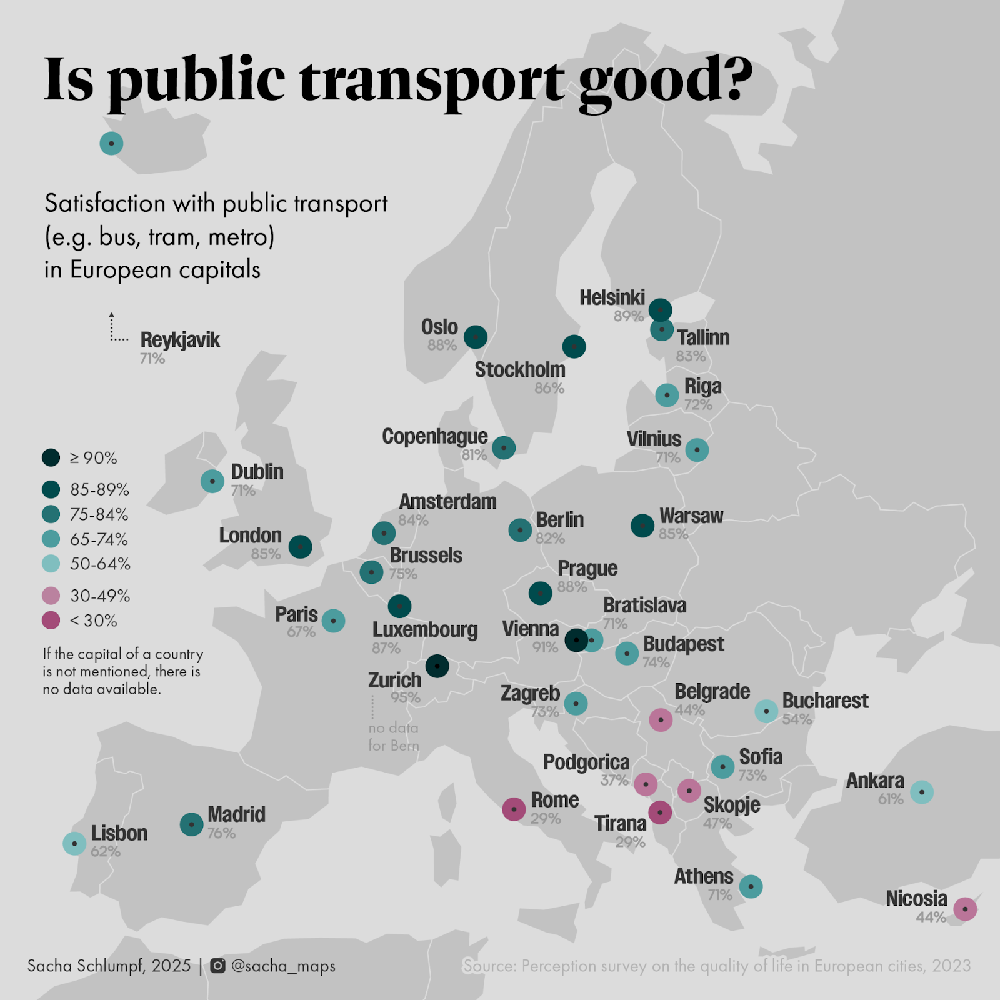

What is visual hierarchy? And why does it matter?
Let’s take this map as an example. Have a look:

](./625898420_18089730611012988_7581338140825957255_n.jpg)

Some elements really grab the attention: the title, and the blue frame around the map. And, as the size of the numbers seems to depend on the countries’ sizes, you might notice the 82 in Germany before the 74 in Slovenia.

But the biggest problem here: 82 and 74 do not correspond to Germany and Slovenia: they are percentage values for Berlin and Ljubljana, the capital cities. Which you understand by reading the subtitle. However, as I noticed when showing the map to students: many will miss the subtitle, and therefore, completely misunderstand the values.

That’s due to bad visual hierarchy. It’s an important concept in many fields of design, including cartography, where visual hierarchy is defined as “graphical implementation of a ranked order of map elements such that the most important elements have the greatest visual prominence”[1](#ref-1).

## Step 1: Think of your map as elements

You can think about a map as an ensemble of different elements. For the surrounding elements, it can be easy. Here we have: a logo, title, sub-title, frame (around the map), source, and hashtag. Let’s do the same for the map. What elements make the map, a map? Here, it would be: countries' colors, countries' borders, numbers, and arrows.

Try to do the same with your map!

## Step 2: What is the function of these elements?

Now, for each element, ask yourself: what is its function? Some examples:

- Subtitle: key for understanding the map
- Countries' borders: distinguishing countries / knowing to which country the value belongs
- Frame around the map: separate the map from the surrounding elements

By doing this, you think of the **purpose** (function) of each of your elements. Doing this will help you determine which importance to give them. Again, do the same with your map!

## Step 3: Is this function necessary?

Once you’ve identified the function of all your elements, ask yourself, is that function really necessary? By doing this, instead of wondering “does my map need a north arrow?”, you start asking “does my map need an additional element which helps locate the depicted area?” Which is way less abstract! This will sometimes lead you to the answer that, no, this function is not needed on my map. If the function is not necessary, then you don’t need to include that element on your map. Get rid of that north arrow!

In our example, not only does the blue frame grab too much attention, but it is probably not even needed at all.

## Step 4: If yes, how important is this function?

If the function is necessary, then you can judge how important it is. Some functions are absolutely key to your map, e.g., the data you are showing. Some functions are only there to support your information, e.g., the countries' borders. And some fall into a third category: the function should exist for readers looking for it, but it is fine if not all readers notice it.

So, you can split your functions into three categories: key information (e.g., the data), supporting elements (e.g., the countries), and the optional reading (e.g., data source and author). Note: these examples in brackets do not apply to all maps: you should judge based on your message and your audience.

You can structure your thoughts as a list:

1. Key information:
2. Supporting elements:
3. Optional reading:

## Step 5: Design!

Now that you have thought about your elements, you can translate this hierarchy into a visual language: that’s visual hierarchy!

Basically, using many tricks, you can give some elements more (or less) importance to the readers’ eye. Imagine it like you would highlight a word in a book: it grabs the attention. But if you highlight all the words except one, the one not highlighted will grab the attention. It’s all about **contrast**. And there are many variables you can play with to create contrast:

- Color (changing its hue, value, or saturation)
- Size
- Position
- Grouping (e.g., in a legend, you can highlight one important category by distancing it from the others, which are grouped)
- Etc.

Think of your map as two layers: your key information and your base map. The base map should not grab the attention! It only supports your information. The base map is not the core of your map: it serves to locate the data you are showing. Make it subtle. Create enough contrast between these two layers!

Here is my attempt at redesigning the map with a better visual hierarchy. I got rid of the frame, categorized the values, and most importantly, the data is now clearly associated with the capital cities, which are named! As this is key information to understand the map, a subtitle was likely not enough.

Visual hierarchy is a fascinating topic. Try to play with it when making maps!

## Sources

- Brewer, C. A. (2024). Designing Better Maps: A Guide for GIS Users (3rd ed). ESRI, Incorporated.
- Tait, A. (2018). Visual Hierarchy and Layout. The Geographic Information Science & Technology Body of Knowledge (2nd Quarter 2018 Edition), John P. Wilson (ed.).
- Urano, Y., Kurosu, A., Henselman-Petrusek, G., & Todorov, A. (2021). Visual Hierarchy Relates to Impressions of Good Design. Center for Open Science.
