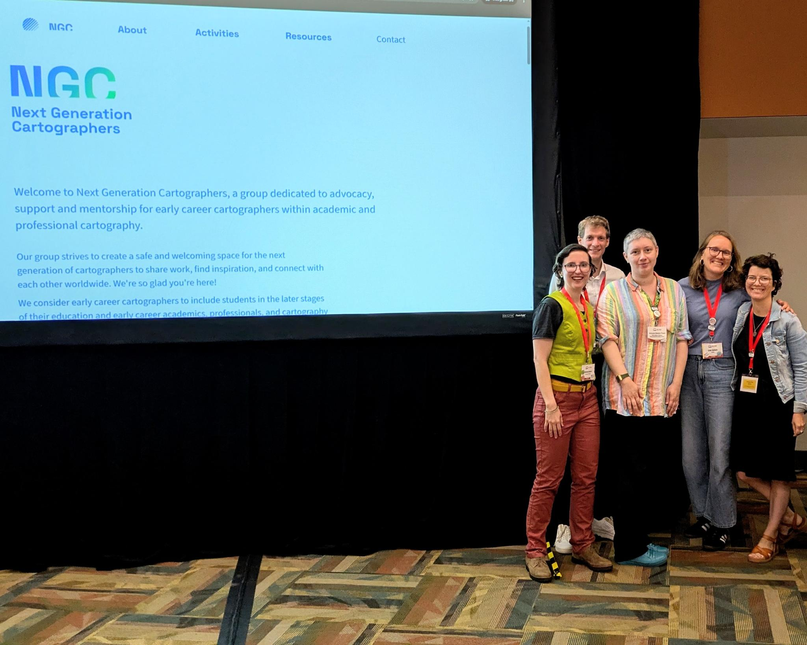

From 17 to 22 August, NGC attended and contributed to the International Cartographic Conference (ICC) in Vancouver, Canada. We enjoyed the exchange with many of you, the discussions on the code of conduct, the workshops, our meet-up with another round of bingo, the impressive map exhibition and many interesting presentations. You can find an overview of all our conducted activities, as well as some materials, [here](../activities/icc-2025). We hope to keep the conversations going.

