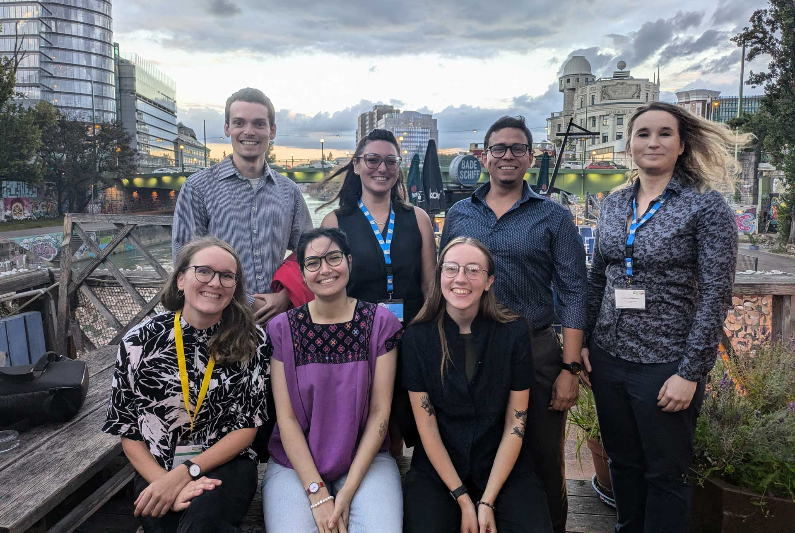

# Young scholar contributions to EuroCarto&nbsp;2024

During the opening ceremony of the EuroCarto 2024 conference in Vienna, young scholars were invited to share their views on the question:

> How do you envision the role of cartography in the next decades?

We think the resulting contributions offer interesting, diverse and multimedial insights and as Next Generation Cartographers, we wanted to document them. We’re happy to be able to publish most of the contributions on our website and want to thank the young scholars for their work.

The order of the contributions is the same as at the opening ceremony.

In the photo from back left to front left: Luka Laval, Merve Keskin, Eliezer Fajardo Figueroa, Markéta Beitlová, Lily Houtman, Danai-Maria Kontou and Ester Scheck (_local organizing team_)

## Lily Houtman

(they / them)  
_PhD Student at The Pennsylvania State University, United States​_

My work is on mobile thematic map design, and so when I think about the future of cartography, I think about **additional technologies** we might make maps on, such as smartwatches. One of the most important things, in my opinion, when developing maps for new technical interfaces is ensuring the maps are **accessible** to people **with all types of abilities**, such as blind and vision impaired people, or people with limb differences. In thinking about this **more inclusive cartography**, I also think about **who is not represented** by modern hegemonic standards of cartography. I think that the future of cartography will be **more inclusive of feminist, queer, and Indigenous perspectives**, ones which questions concepts such as borders. As academics, we seek to grow and expand the field of cartography, so **diverse viewpoints will create more opportunities**, making the field better.

## Luka Laval

(he/him)  
_M.Sc. Cartography_

As a cartography student, I think striking a balance between simplicity and technology is crucial to the future of our discipline.

The technological advances afford us impressive tools, but we need to be cautious not to let them dominate every aspects of mapmaking. Maps should be **simple, clear, legible and easy to make**. This is where we too often ruin maps by complicating them with **layers of unnecessary technology**. We should remember the reason we do the work we do — to **help people find their way through the world** and better understand and engage.

Instead of overwhelming users or making them dependent, **cartography should empower and support them**. Despite the tendency toward greater complexity (due to excessive technology use), I hope we can work toward **clarity and simplicity** above all.

## Danai-Maria Kontou

(she/her, they/them)  
_Vrije University Amsterdam_

originally published on [Danai’s blog](https://danaiscosmographics.com/blog/an-ode-to-the-future-of-cartography):

**An Ode to the Future of Cartography**

I was asked to share my thoughts on the future with maps  
Well, I mainly see uncertainties be and expand  
Boiling wars, fierce storms, floods, and doom’s heavy demand  
Climate urgency, fires, emergencies, what’s left of this land

But I long for maps that share the landscapes of my dreams  
Where whispering winds tell tales that shift with the streams  
A map of lost things, where memories dance and gleam  
Maps of endless possibilities, with futures yet unseen

Maps where stars and moons reveal new paths in the night  
A dreamscape world where shadows and light unite  
Lost treasures await in corners, hidden from sight  
As synesthetic hues turn sound into vibrant light

Yet, I fear maps will remain shrank into screens where we zoom in and out  
And people will still ask me if I make Google Maps, no doubt!  
I make my maps with strings that vibrate; you hear them loud  
I just express myself quirky, creative, apparently a fairground  
Treads that weave a process, data on blooming flowers  
Like it or not, maps will always have unlimited powers

I wish for maps of joy, where wars don’t roam about,  
Where pandemics cease, and justice’s voice will shout,  
A world where solidarity is the norm, throughout,  
No bombs, no hunger, no borders harsh and stout,  
Where every community is seen, and love is devout.  
I dream of maps inclusive and sound.

For every line we draw, in every map we make,  
Lies the power to heal, to unite, and to awake.  
I invite you to let us dream, let us dare, and let us design,  
A world where our maps reflect humanity’s shine.

## Markéta Beitlová

(she/her)  
_Cartographer at Palacky University​_

This contribution is a song, based on input by the author and implemented with the AI audio tool Suno to compile the lyrics and provide the music and voice. Listen to the song on [Youtube](https://www.youtube.com/watch?v=pkPUAV9GOas)

_Lyrics_:  
Cartography's future, in the hands of fans,  
Evergreen research, mapping new lands,  
Tech evolving quick, multidisciplinary sands,  
Methods shifting swift, charts and plans.

Peering through time like an unpredictable prism,  
User research core, no schism, no ism,  
Tech talk, methods walk, bridging gaps with wisdom,  
Maps telling tales, ink scribbles in the system.

Believe in the power, evergreen, it showers,  
New approaches, blooming flowers, hour after hour,  
Future's bold, tech unfolds, mystery tower,  
In all of us, the map, the ultimate power.

Compass spins wild, scanning the digital sea,  
Cartography morphs, a living, breathing decree,  
Multidisciplinary mix, in unity, we agree,  
In collective hands, hold the mapping key.

Tech redefined, with layers, we intertwine,  
Surveying the mine, on the data line,  
Methods align, synchronous, time after time,  
Mapping the climb, in rhythm and rhyme.

Believe in the power, evergreen, it showers,  
New approaches, blooming flowers, hour after hour,  
Future's bold, tech unfolds, mystery tower,  
In all of us, the map, the ultimate power.

## Merve Keskin

(she/her)  
_Post-doctoral researcher ​at the Department of Geoinformatics (Z_GIS), ​University of Salzburg (PLUS)​_

The future of cartography is bright, but it requires us to think beyond traditional definitions. While others may think the term "cartography" is outdated, its core principles – providing information about location and spatial relationships – still remain relevant today. On the other hand, **the way we interact with maps** will always continue to evolve, and our expertise in designing user experiences and creating meaningful visualizations is more crucial than ever.
With artificial intelligence, we can expect more **dynamic and personalized maps** that adapt to individual needs and preferences. Imagine maps that anticipate where you are, what you're doing, and what you need, based on your unique characteristics. (This level of personalization can be achieved through technologies like smartphone eye tracking). This is the future of cartography. To achieve this future, we must **collaborate with other disciplines**. Because this is the only way to develop more comprehensive and impactful solutions and **open science** can facilitate this collaboration.
Finally, the future of cartography is bright, thanks to the contributions of **women**. Women are not only driving technological advancements but also mentoring and inspiring "the next generation cartographers". Our ability and empathy to take action on pressing societal issues like public health and climate change are crucial in creating maps that truly empower individuals and contribute to a better understanding of our world.
